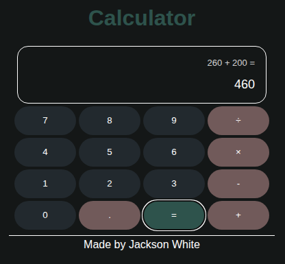

# Calculator

A simple calculator built with vanilla JavaScript. 

## Stack

- HTML
- CSS
- JavaScript

## Goals

- Refresh JavaScript fundamentals
- Practice DOM manipulation
- Practice event listeners
- Manage application state
- Build a functional calculator without a framework

## What I Learned

- How to select and manipulate DOM elements with JavaScript
- How to handle button clicks with event listeners
- How to use functions to separate different pieces of logic
- How to manage calculator state using variables
- The difference between strings and numbers in JavaScript
- How `parseInt()` and `parseFloat()` behave differently
- How to structure a small interactive application
